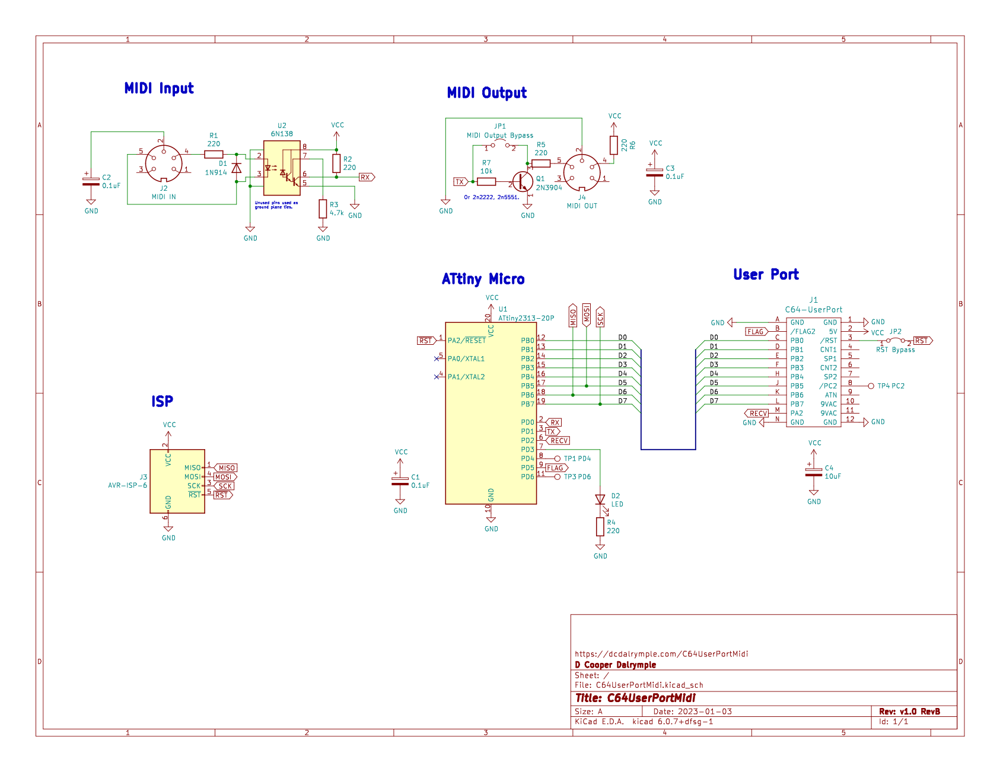

# Commodore 64 User Port Midi Input Device
> Simple Midi Input via the Commodore 64 User Port Interface 
> Created by D Cooper Dalrymple 2021 - [dcdalrymple.com](https://dcdalrymple.com/) 
> Licensed under GNU GPL V3.0 

I found myself in possession of a Commodore SX-64 and a desire to make music with it. After quickly finding [Cynthcart](https://www.qotile.net/cynthcart.html), I wasn't too happy about the idea of plugging both the Cynthcart cartridge and a separate Datel midi cartridge into in a [Mini X-Pander+](http://www.arkanixlabs.com/minixpander/) all sticking out of the hood of my SX-64. I had assumed that the User Port would have been a great interface for transmitting the necessary midi input data to whatever SID program you're jamming with. That's where this project comes in.

## Functionality
The concept is fairly simple: as soon as any data comes in via UART from a midi device, it is piped over to the shift register which is connected to the 8 data pins of the user port and the user port's flag interrupt pin is triggered. The compatible Commodore software that has an interrupt registered for the user port's flag pin then adds that 8-bit data register to a data buffer. The midi information would then need to be processed by the main loop of the software. Easy peasy!

I am aware that there are serial lines available on the user port that have been used for RS-232 communication and such, but I wanted to use the least amount of resources when transferring data from the bus to the Commodore software. A simple `lda $DD01` is all that is necessary to get the full byte during a flag interrupt.

## Components
I mostly used the components I had sitting around to design this which is why I picked the very limited ATtiny13A microcontroller to handle UART communication (without a UART hardware controller). That being said, the simple discrete components required make this an inexpensive option compared to other options out there. The [BOM I've compiled](https://www.digikey.com/BOM/Create/CreateSharedBom?bomId=8564682) makes this roughly $10 for all the parts (not including the PCB).

## Development Status
Though my partially-functioning prototype has been successful, I am waiting for the final PCB to be manufactured to test the full capabilities of this device. I advise from producing your own until that time.

## Software
A simple testing cartridge for the C64 is in development. This should easily fit on a small 8kb lo-rom cart and could be compiled for floppy if needed.

I plan to fork the Cynthcart repo once testing is completed to include full compatibility with this device.

## Midi Thru
I know this device is limited in that it doesn't include a midi thru port, but I recommend using an external midi thru box (such as those offered by [MIDI Solutions](http://midisolutions.com/)) if desired.
