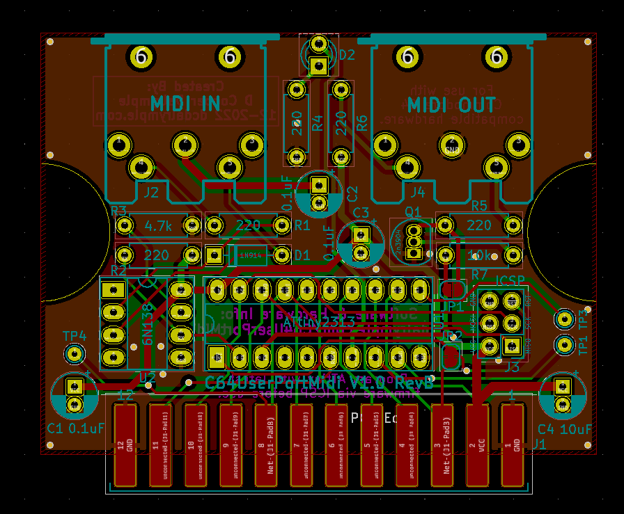

# Commodore 64 User Port Midi Device
> Simple Midi Input & Output via the Commodore 64 User Port Interface 
> Created by D Cooper Dalrymple 2021 - [dcdalrymple.com](https://dcdalrymple.com/) 
> Licensed under GNU GPL V3.0 

I found myself in possession of a Commodore SX-64 and a desire to make music with it. After quickly finding [Cynthcart](https://www.qotile.net/cynthcart.html), I wasn't too happy about the idea of plugging both the Cynthcart cartridge and a separate Datel midi cartridge into in a [Mini X-Pander+](http://www.arkanixlabs.com/minixpander/) all sticking out of the hood of my SX-64. I had assumed that the User Port would have been a great interface for transmitting the necessary midi input data to whatever SID program you're jamming with. That's where this project comes in.

## Functionality
The concept is fairly simple: the stream of data from the midi input will be piped into a buffer by the microcontroller. After representing the value of each byte on the data bus of the user port (PB0-7), it will then trigger the user port's flag interrupt (FLAG2) to indicate new data is available. The compatible Commodore software that has an interrupt registered for the user port's flag pin then adds that 8-bit data register to a data buffer. The midi information would then need to be processed by the main loop of the software. Easy peasy!

I am aware that there are serial lines available on the user port that have been used for RS-232 communication and such, but I wanted to use the least amount of resources when transferring data from the bus to the Commodore software. A simple `lda $DD01` is all that is necessary to get the full byte during a flag interrupt.

The 8 bits of the user port are bi-directionally connected to the microcontroller, and a data transfer back to the microcontroller can be flagged using the dedicated GPIO pin, PC2. This functionality can be used to send midi data back out through the Midi Out port and perform additional functionality that has yet to be developed (channel filters, etc).

## Components
The microcontroller chosen for this project is the ATtiny2313. Using this micro reduces the total BOM by not requiring an external crystal oscillator, operating at 5V, including a hardware UART controller, and having just the right amount of GPIO.

Overall, the BOM is fairly minimal and using only through-hole components for easy assembly. To quickly get started making your own, I've assembled a [Digikey shared cart](https://www.digikey.com/short/7djhm4fz) with the exact hardware requirements and all of the necessary gerber files to order your own PCBs from a distributor such as PCBway.

## Development Status
I've just completed revision A of the hardware design which migrated from the ATtiny13 to ATtiny2313 and removed the need for a shift register. I've also added the components required MIDI output since the new microcontroller should be able to handle UART transmission with ease.

The firmware hasn't yet been updated for this new board design, but the functionality should mostly remain the same within the C64 software. I'll provide examples of bidirectional data transfer showcasing the output functionality of the new board once any bugs have been worked out.

I advise from producing your own units until the hardware and software have been fully developed.

## Software
A testing cartridge for the C64 is in development and mostly complete. This easily fits on a small 4kb/8kb lo-rom cart and could be compiled for floppy if needed. It can be run in emulation, but it isn't very useful unless the debugging data is enabled.

I plan to fork the Cynthcart repo once testing is completed to include full compatibility with this device.
